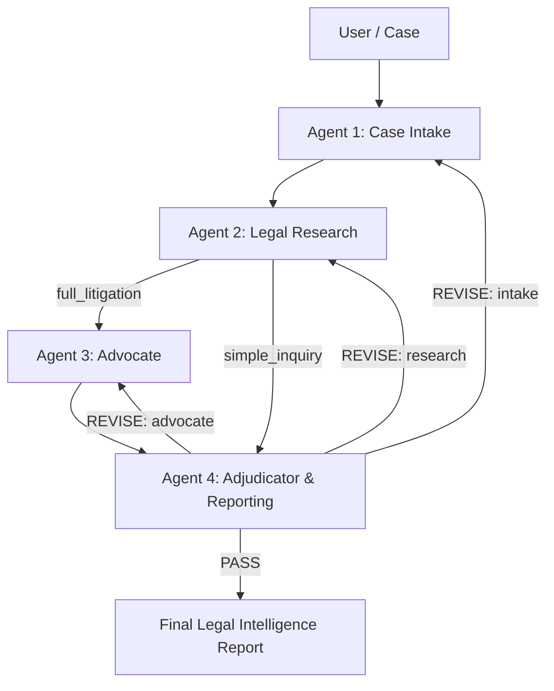
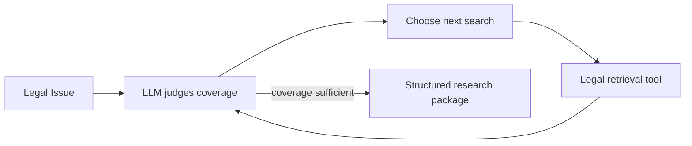
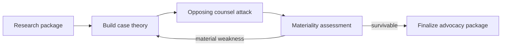
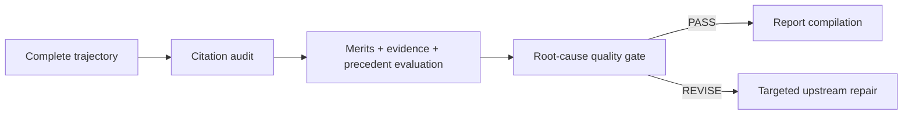

# LexIntel AI Architecture

## Runtime architecture

## Agent 2 decision loop

## Agent 3 deliberation loop

## Agent 4 quality gate

The graph is intentionally deterministic at the orchestration layer. The LLM makes decisions inside each agent about research strategy, argument construction, adversarial materiality, and quality-gate remediation; LangGraph controls the safe execution topology and revision ceiling.
